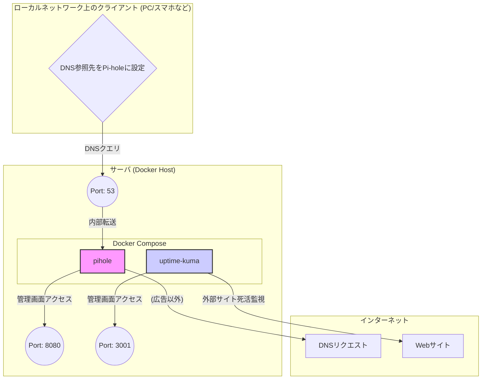

# Pi-holeとUptime KumaによるDNS広告ブロックとWeb監視環境の構築手順書

> 本手順書は、Docker Composeを利用して、DNSレベルでの広告ブロッキングを実現する「Pi-hole」と、サービスの稼働状況を監視する「Uptime Kuma」を同一サーバ上に構築する手順をまとめたものである。

---

## 1. 目的と完成条件の定義

### 目的
ローカルネットワーク内に、DNSシンクホール方式で広告をブロックする機能と、Webサイトやサーバの死活監視を行う機能を導入することである。これにより、ネットワーク全体の通信品質向上と、安定したサービス運用のための監視基盤を確立する。

### 完成条件
- Pi-holeの管理画面に `http://<サーバのIPアドレス>:8080` でアクセスでき、ログイン後、ダッシュボードが表示されること。
- Uptime Kumaの管理画面に `http://<サーバのIPアドレス>:3001` でアクセスでき、初期設定後、ダッシュボードが表示されること。
- ネットワーク内のクライアント（PCやスマートフォン）のDNS設定をPi-holeサーバに向けることで、広告がブロックされることを確認できること。
- Uptime Kumaに監視対象（例：`https://google.com`）を登録し、そのステータスが「稼働中」として表示されること。

## 2. 全体構成とポート設計

本構成は、Dockerホスト上で2つのコンテナ（`pihole`, `uptime-kuma`）をDocker Composeによって管理するものである。

- **pihole**:
    - DNSサーバとして機能し、広告ドメインへの名前解決要求をブロックする。
    - `53/tcp`, `53/udp`: DNSクエリ用のポートである。
    - `8080/tcp`: Web管理画面用のポートである（ホスト側の80番ポートとの競合を避けるため8080番にマッピング）。
- **uptime-kuma**:
    - 各種プロトコル（HTTP(S), Ping, TCP等）でサービスの死活監視を行う。
    - `3001/tcp`: Web管理画面用のポートである。



## 3. 前提条件

- **対象OS**: Windows 11 Home (WSL2ではport 53は禁止されているため、今回は断念した。)
- **実行環境**: Docker Desctop
- **利用ツール**:
    - `docker`
    - `docker-compose` (v2)
- **ネットワーク条件**:
    - サーバに固定のプライベートIPアドレスが割り当てられていること。
    - インターネットへの疎通が可能であること。

## 4. 構築手順

### 4.1. 事前準備 (DockerおよびDocker Composeのインストール) (Docker Desktopを使用している場合は不要)

1.  **パッケージリストの更新とアップグレード**
    システムのパッケージ情報を最新の状態に更新し、インストール済みのパッケージをすべてアップグレードする。
    ```bash
    # aptが管理するパッケージのリストを更新
    sudo apt update
    # インストール済みのパッケージを新しいバージョンに更新
    sudo apt upgrade -y
    ```

2.  **Dockerリポジトリ設定に必要なパッケージのインストール**
    HTTPS経由でリポジトリを利用するためのツールや、DockerのGPGキーを安全に扱うためのパッケージをインストールする。
    ```bash
    # aptがHTTPS経由でリポジトリを使用できるようにする依存関係や、URLからファイルを取得するcurlなどをインストール
    sudo apt install -y ca-certificates curl gnupg
    ```

3.  **Dockerの公式GPGキーの追加**
    Docker公式リポジトリからダウンロードするパッケージが、正当なものであることを検証するためにGPGキーを設定する。
    ```bash
    # GPGキーを保存するディレクトリを作成
    sudo install -m 0755 -d /etc/apt/keyrings
    # DockerのGPGキーをダウンロードし、キーリングに変換して保存
    curl -fsSL https://download.docker.com/linux/ubuntu/gpg | sudo gpg --dearmor -o /etc/apt/keyrings/docker.gpg
    # すべてのユーザーがGPGキーを読み取れるように権限を設定
    sudo chmod a+r /etc/apt/keyrings/docker.gpg
    ```

4.  **Dockerのaptリポジトリ設定**
    aptがDockerパッケージを見つけられるように、Dockerの公式リポジトリをソースリストに追加する。
    ```bash
    # OSのアーキテクチャとバージョン情報を元に、Dockerのリポジトリ情報をsources.listファイルに書き込む
    echo \
      "deb [arch=$(dpkg --print-architecture) signed-by=/etc/apt/keyrings/docker.gpg] https://download.docker.com/linux/ubuntu \
      $(. /etc/os-release && echo "$VERSION_CODENAME") stable" | \
      sudo tee /etc/apt/sources.list.d/docker.list > /dev/null
    ```

5.  **Docker Engineおよび関連パッケージのインストール**
    リポジトリ情報を再度更新し、Docker本体、CLI、containerd、およびDocker Composeプラグインをインストールする。
    ```bash
    # 追加したリポジトリを含めてパッケージリストを再度更新
    sudo apt update
    # Docker関連パッケージ一式をインストール
    sudo apt install -y docker-ce docker-ce-cli containerd.io docker-buildx-plugin docker-compose-plugin
    ```

6.  **Docker Composeのインストール確認**
    `docker compose` コマンドが正常に利用できるかを確認する。
    ```bash
    # インストールされたDocker Composeのバージョン情報を表示
    docker compose version
    # "Docker Compose version v2.x.x" のように表示されれば成功
    ```

### 4.2. プロジェクトディレクトリと設定ファイルの作成

1.  **プロジェクト用ディレクトリの作成と移動**
    この後の作業はすべてこのディレクトリ内で行う。
    ```bash
    # 'dns-server'という名前でディレクトリを作成
    mkdir dns-server
    # 作成したディレクトリに移動
    cd dns-server
    ```

2.  **`docker-compose.yml`の作成**
    エディタで `docker-compose.yml` ファイルを新規作成し、以下の内容を貼り付けること。

    **ファイルパス:** `./dns-server/docker-compose.yml`
    
    **所有権・権限:** このファイルはコマンドを実行する一般ユーザーが所有し、特別な権限は不要である（デフォルトの `644` で問題ない）。Dockerデーモンが読み取るため、少なくとも読み取り権限が必要である。

    **`docker-compose.yml` (完全版)**
    ```yaml
    services:
      pihole:
        container_name: pihole
        image: pihole/pihole:latest
        ports:
          - "53:53/tcp"
          - "53:53/udp"
          - "8080:80/tcp" # Web UI用ポート (80番が競合する場合を考慮)
        environment:
          TZ: 'Asia/Tokyo'
          # 非常に強力なパスワードに変更すること
          WEBPASSWORD: "pass"
        volumes:
          - './etc-pihole:/etc/pihole'
          - './etc-dnsmasq.d:/etc/dnsmasq.d'
        # 推奨される capability: ネットワーク関連の高度な操作を許可
        cap_add:
          - NET_ADMIN
        dns:
          - 1.1.1.1 # コンテナ自身が名前解決するためのDNS
        restart: unless-stopped

      uptime-kuma:
        image: louislam/uptime-kuma:1
        container_name: uptime-kuma
        volumes:
          - ./uptime-kuma-data:/app/data
        ports:
          - "3001:3001" # Web UI用ポート
        restart: unless-stopped
    ```
    **【重要】** `WEBPASSWORD` の値 `"pass"` は非常に脆弱であるため、必ず推測されにくい強力なパスワードに変更すること。

### 4.3. サービスの起動と永続化

1.  **Dockerコンテナの起動**
    `docker-compose.yml` があるディレクトリで、以下のコマンドを実行する。`-d` オプションにより、コンテナはバックグラウンドで起動（デーモン化）する。
    ```bash
    docker compose up -d
    ```

2.  **コンテナの起動状態を確認**
    `ps` コマンドで、定義したサービスがコンテナとして起動しているかを確認する。
    ```bash
    docker compose ps
    ```
    `pihole` と `uptime-kuma` の `STATUS` が `running` または `up` となっていれば正常に起動している。

3.  **サービスの永続化について**
    `docker-compose.yml` 内の `restart: unless-stopped` という設定により、コンテナは手動で停止しない限り、Dockerデーモンの起動時（OS再起動時など）に自動的に再起動する。これにより、サービスの永続化が実現される。

## 5. 動作確認と検証

### 5.1. Pi-holeの確認

1.  **管理画面へのアクセス**
    Webブラウザで `http://<サーバのIPアドレス>:8080/admin/` にアクセスする。Pi-holeのダッシュボードが表示されるはずである。
2.  **ログイン**
    `docker-compose.yml` で設定した `WEBPASSWORD` を使ってログインし、詳細な設定や統計情報を確認できることを確かめる。
3.  **DNS設定と広告ブロックのテスト**
    - PCやスマートフォンのネットワーク設定を開き、DNSサーバのアドレスをPi-holeを起動したサーバのIPアドレスに変更する。
    - 広告が多く表示されるWebサイトにアクセスし、広告が非表示になることを確認する。
        - **DailyMail**: [https://www.dailymail.co.uk/](https://www.dailymail.co.uk/)
        - **Block Ads!**: [https://blockads.fivefilters.org/](https://blockads.fivefilters.org/)
    - Pi-holeの管理画面で、クエリログにクライアントからのDNS要求が表示されていることを確認する。

### 5.2. Uptime Kumaの確認

1.  **管理画面へのアクセスと初期設定**
    Webブラウザで `http://<サーバのIPアドレス>:3001` にアクセスする。初回アクセス時は、管理者アカウントの作成画面が表示されるので、ユーザー名とパスワードを設定すること。
2.  **監視モニターの追加**
    - ログイン後、ダッシュボードの「＋監視を追加」ボタンをクリックする。
    - **監視タイプ**: `HTTP(s)` を選択する。
    - **分かりやすい名前**: `Google疎通確認` など、任意の名前を入力する。
    - **URL**: `https://google.com` を入力する。
    - 「保存」をクリックする。
3.  **ステータスの確認**
    ダッシュボードに新しい監視項目が追加され、ステータスが緑色の「稼働中」になることを確認する。
4.  **ログの確認方法**
    問題が発生した場合、以下のコマンドで各コンテナのログを確認できる。
    ```bash
    # Pi-holeのログを表示
    docker compose logs pihole
    
    # Uptime Kumaのログを表示
    docker compose logs uptime-kuma
    ```
5.  **実用**
    実用するにあたっては、DNSサーバーを監視するとよい。

## 6. トラブルシューティング

- **ポートが競合してコンテナが起動しない**
    - **原因**: ホストOSで既に使用されているポート（特に53番や80番）をコンテナに割り当てようとするとエラーになる。
    - **対処**: `docker-compose.yml` の `ports` 設定を変更する。例えば、`"8080:80/tcp"` の左辺 `8080` を別の空いているポート番号（例：`8081`）に変更し、`docker compose up -d` を再実行する。
- **Pi-holeのパスワードを忘れた**
    - **対処**: `docker-compose.yml` の `WEBPASSWORD` を確認または再設定し、`docker compose up -d` を実行すれば設定が更新される。
- **Pi-holeのパスワードがymlファイル通り設定されていない**
    - **対処**: `docker exec pihole pihole setpassword "${任意のパスワード}"`を実行する。
- **データが消えてしまう**
    - **原因**: `volumes` を設定せずにコンテナを削除・再作成するとデータは失われる。
    - **対処**: 本手順書の `docker-compose.yml` では、`./etc-pihole` や `./uptime-kuma-data` のようにホスト側のディレクトリにデータを永続化（マウント）しているため、コンテナを再作成しても設定は維持される。バックアップが必要な場合は、これらのディレクトリをコピーすること。
- **Pi-holeには接続できているが、広告がブロックされない。**
    - **原因**: 代替DNSやIPv6が使用されいている。
    - **対処(Client側)**: <br>
          1. ネットワーク設定からの代替DNSを空欄にし、IPv6を無効にする。　<br>
          2. `コントロールパネル > ネットワークとインターネット > ネットワークと共有センター > アダプターの設定の変更`ですべての接続のプロパティから、「インターネット　プロトコル　バージョン6(TCP/IPv6)」のチェックを外す。<br>
          3. 管理者権限のコマンドプロンプトを起動し、`ipconfig /flushdns`を実行する。 <br>
          4. コマンドプロンプトで`nslookup google.com`を実行し、`Address: ${DNSサーバーのIPアドレス}`と表示されたら成功。 <br>

## 7. セキュリティ配慮

- **強力なパスワードの設定**
    Pi-holeの `WEBPASSWORD` は必ず推測されにくい複雑なものに設定すること。
- **管理画面の公開範囲**
    本構成では、管理画面がローカルネットワーク内に公開される。外部の不特定多数からアクセスできる環境（パブリッククラウドなど）で運用する場合、ファイアウォールで特定のIPアドレスからのみアクセスを許可したり、リバースプロキシを導入して認証を強化するなどの追加対策が必須である。
- **秘密情報の管理**
    `WEBPASSWORD` のような秘密情報は、`docker-compose.yml` に直接記述する代わりに、`.env` ファイルに分離して管理することが推奨される。
    
    **`.env` ファイルの例**
    ```
    PIHOLE_PASSWORD=YourVeryStrongPassword!
    ```

    **`docker-compose.yml` の修正例**
    ```yaml
    # ...
        environment:
          TZ: 'Asia/Tokyo'
          WEBPASSWORD: '${PIHOLE_PASSWORD}'
    # ...
    ```

## 8. 参考資料

- **Pi-hole (Docker)**: [https://github.com/pi-hole/docker-pi-hole/](https://github.com/pi-hole/docker-pi-hole/)
- **Uptime Kuma**: [https://github.com/louislam/uptime-kuma](https://github.com/louislam/uptime-kuma)
- **Docker公式ドキュメント**: [https://docs.docker.com/](https://docs.docker.com/)
